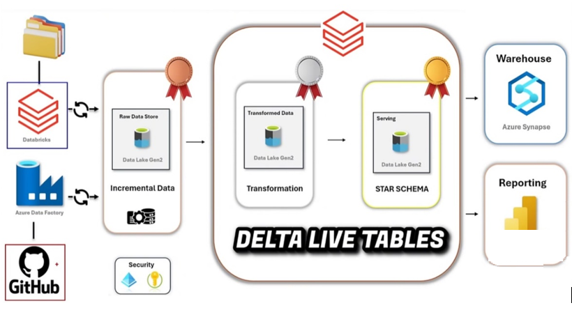

# End-to-End Azure Data Engineering Project

## 🔍 **Overview**

This project showcases a robust data engineering pipeline built on **Azure** and **Databricks**, implementing the **Medallion Architecture** (Bronze, Silver, Gold) to process and analyze **Netflix data**. It integrates services such as **Azure Data Factory**, **Azure Data Lake Storage (ADLS)**, **Databricks Autoloader**, **Delta Live Tables**, and **Unity Catalog** to ensure scalable, automated, and governed data workflows.

---

## 🏗️ Architecture & Pipeline Flow

### 🥉 Bronze Layer – Data Ingestion

- A dedicated **Azure Resource Group** and **Azure Data Lake Storage (ADLS)** account were set up with containers for `raw`, `bronze`, `silver`, and `gold` layers.
- **Azure Data Factory (ADF)** pipelines were used to ingest data from **GitHub's  as public API**
- A linked service connection was established: `GitHub → ADF → ADLS`.
- This layer stores **raw, unprocessed data** to serve as the foundational stage for downstream transformation.

### 🥈 Silver Layer – Data Transformation

- A **Unity Catalog** was created to enable **fine-grained access control** and centralized governance across the Databricks workspace.
- A **Databricks Access Connector** was configured to allow **secure access** between Databricks and ADLS.
- **Databricks Autoloader** was used to incrementally read data from the **Bronze** layer, enabling **efficient and automated ingestion** into Databricks.
- Data was **cleaned, transformed, and normalized** using **Databricks notebooks** and **Workflows**.
- The processed output was stored in the **Silver container** as **Delta Tables**, enabling **versioned, query-optimized storage**.

### 🥇 Gold Layer – Data Aggregation & Serving

- In the **Gold** layer, **Delta Live Tables (DLT)** were used to define **real-time data transformations** and apply **business-level aggregations**.
- A **Star Schema** structure was implemented to prepare data for **analytical workloads**.
- Final curated datasets were saved in the **Gold container** 
- **Databricks Workflows** were used to **orchestrate and schedule** regular job runs for data freshness.
- The refined data was made available for **Power BI reporting** and **data warehousing** via **Azure Synapse Analytics**.

---

## 🛠️ Tools & Technologies Used

- **Azure Data Factory (ADF)** : For orchestrating data ingestion from GitHub into the Bronze layer.

- **Azure Data Lake Storage Gen2 (ADLS)** : Hierarchical storage for Bronze, Silver, and Gold layers, supporting Medallion Architecture.

- **Azure Databricks** : Unified platform for scalable data processing, transformation, and analytics.

- **Delta Lake** : Provides ACID transactions and scalable metadata handling on top of data lakes.

- **Delta Live Tables (DLT)** : Enables declarative real-time data pipelines with quality enforcement and lineage tracking.

- **Unity Catalog** : Centralized data governance for fine-grained access control and metadata management.

- **Databricks Workflows** : Pipeline orchestration tool for scheduling and managing jobs within Databricks.

---

  ## ✅ Conclusion

This project demonstrates how to design and implement a modern data pipeline using the Medallion Architecture with Azure and Databricks. From raw data ingestion to curated analytics-ready datasets, the pipeline ensures scalability, governance, and performance across all layers.

